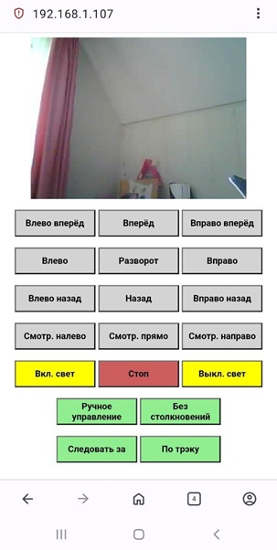

Прошивки модулей конструктора TSCINBUNY ZYC0076.

Исправлено:
1. Удалён мусор и артифакты из кода.
2. Апгрейд до последней версии фрэймворка ESP32 (v. 3.2.0)
3. Руссифицированы кнопки управления
4. Добавлена кнопка возврата головного модуля в среднее положение
5. Оптимизированы настройки камеры (модуль OV2640)
